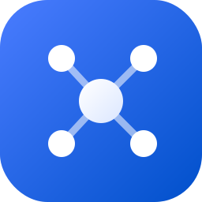
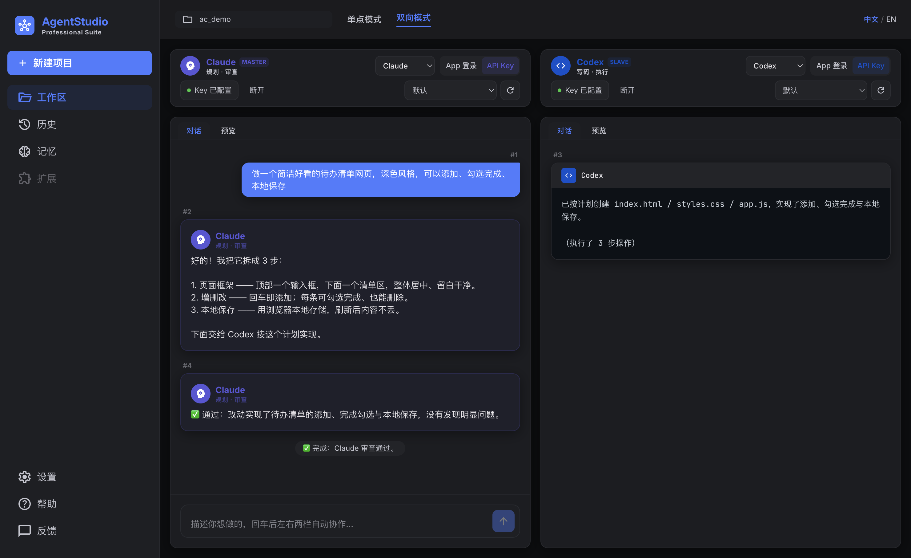
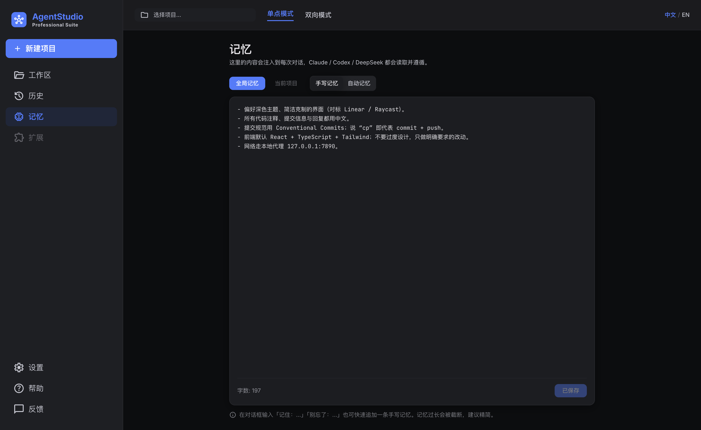

<p align="center">
  
</p>

<h1 align="center">AgentStudio</h1>

<p align="center">
  <b>两个 AI 智能体，一个干净的桌面工作室 —— 一个负责规划与审查，一个负责写代码。</b><br/>
  用大白话说出你想做什么，看 Claude、Codex(以及 DeepSeek)替你把它做出来。无需终端。
</p>

<p align="center">
  <a href="LICENSE"></a>
  
  
  
  
  
</p>

<p align="center">
  <a href="README.md">English</a> · <b>简体中文</b> · <a href="https://github.com/zoyluoblue/AgentStudio/wiki">Wiki</a>
</p>

<p align="center">
  
</p>

---

## 这是什么

AgentStudio 是一个 macOS 桌面应用，把两个顶尖编程 AI 并排放在一起、各司其职：

- **Master 栏 —— 规划 / 审查。** 听懂你的目标，拆成简短计划，并在写完后审查代码、把关质量。
- **Slave 栏 —— 写码 / 执行。** 在你的项目里真正新建、修改文件，把功能实现出来。

它要解决的问题：普通人有想法，但「让 AI 帮我写个东西」通常意味着开终端、配环境、看一堆黑底白字的报错。AgentStudio 把这一切收进一个像聊天软件一样友好的窗口里 —— **描述 → 自动完成 → 直接预览成果。**

每一栏都可以运行 **Claude**、**Codex** 或 **DeepSeek**，随意搭配。

## 亮点

- 🤝 **规划 → 写码 → 审查，全自动。** 双向模式下两栏自动协作，不用点任何按钮。
- 💬 **随时插话。** 运行过程中随时打字，追加或纠正指令。
- 👀 **实时预览。** 做出来的网页一写完就在内嵌浏览器里渲染。
- 🧠 **内置记忆，所有模型共享。** 两层记忆(你的手写笔记 + 自动概括的事实)会注入到**所有**后端，让 Claude / Codex / DeepSeek 跨会话保持一致 —— 并且与你电脑上 CLI 自带的记忆**相互隔离**。
- 🔌 **连接方式自选。** 每个后端可用 **App 登录**(OAuth) **或 API Key**，一键连接 / 断开。
- 🎛 **模型任选。** 每个后端真实、自动更新的模型列表(Claude 的 Opus 4.8 / Sonnet 4.6 / Haiku…；Codex 从本地缓存读 GPT-5.5 / 5.4…；DeepSeek 在线拉取)。
- 🌓 **精致且双语。** 浅色/深色主题、中英文界面、带全文搜索的历史记录、按栏的代理控制。
- 🍎 **原生体验。** 选个文件夹、说句话就能开始，告别终端。

## 怎么用

在窗口顶部切换模式：

**单点模式** —— 左右两栏是两条独立对话，分别使唤某一个 AI。

**双向模式** —— 你只给一个目标，两栏自己跑完整个闭环：

```
你：「做一个深色主题的待办清单网页」
      │
      ▼
  Claude(规划)─▶ Codex(写文件)─▶ Claude(审查 diff)
                       ▲                       │
                       └──── 修订(最多 3 轮)◀──┘
                                               │
                                               ▼
                                            ✅ 完成
```

全程无需点击，且任何时刻都能打字插话来纠偏。

## 记忆

AgentStudio 维护**自己的**一套记忆，被每个后端共享，并与本机 CLI 原生记忆隔离(AgentStudio 运行时关闭了 Codex 的跨会话 `memories`)。两层记忆，各自可作用于 **全局**(所有项目)或 **项目**(存在 `<项目>/.agentstudio/`，跟着仓库走、可版本化)：

- **手写记忆** —— 你自己写的，外加在对话框用触发词存下的：`记住 / 别忘了 / remember / don't forget / note that …`。
- **自动记忆** —— 对话结束后无声概括(对齐 Codex / Claude Code 的做法)，再注入到后续运行。可编辑，并支持一键**整理**(去重压缩)与**清空**。

<p align="center">
  
</p>

## 后端与连接

| 后端 | 典型角色 | 连接方式 |
| --- | --- | --- |
| **Claude** | 规划 · 审查(也可写码) | App 登录(`claude` CLI / 订阅) **或** Anthropic API Key |
| **Codex** | 写码 · 执行 | App 登录(`codex` CLI / ChatGPT) **或** OpenAI API Key |
| **DeepSeek** | 规划或写码(文本 / 整文件) | DeepSeek API Key |

任意一栏可用任意后端。App 登录沿用你的订阅；API Key 模式只把 key 注入到对应后端。

## 快速开始

**前置条件**

- macOS、Node.js 18+ 与 npm。
- 使用 **App 登录** 的后端：需先安装并登录 [`claude`](https://claude.com/claude-code) 和 / 或 [`codex`](https://developers.openai.com/codex/cli) 命令行。
- 使用 **API Key** 的后端：准备好 Anthropic / OpenAI / DeepSeek 的密钥(在应用内填写)。

**源码运行**

```bash
git clone https://github.com/zoyluoblue/AgentStudio.git
cd AgentStudio/studio
npm install
npm run dev        # 开发模式启动
```

**打包成可双击的应用(.dmg)**

```bash
npm run dist       # 产物在 studio/release/
```

随后：选项目文件夹 → 在每栏连接一个后端 → 选模式 → 描述你想做的东西。

## 目录结构

```
AgentStudio/
├─ assets/                 # logo + 截图
├─ LICENSE                 # Apache-2.0
└─ studio/
   ├─ electron-builder.yml # 打包配置(macOS dmg)
   └─ src/
      ├─ main/             # Electron 主进程：编排、CLI 驱动、记忆、设置、鉴权
      ├─ preload/          # contextBridge → window.studio API
      ├─ renderer/         # React + Tailwind 界面
      └─ shared/           # IPC 通道与类型约定
```

## 技术栈

Electron 42 · React 19 · TypeScript 5 · Tailwind CSS · `electron-vite`。引擎驱动官方 CLI —— `claude -p`(结构化、只读的规划/审查)与 `codex exec --json`(真实文件改动、可续接会话)—— 并通过 OpenAI 兼容的 HTTP 接口调用 DeepSeek。代码改动通过快照式内容 diff 交给审查方。

## 文档

完整文档见 **[Wiki](https://github.com/zoyluoblue/AgentStudio/wiki)** —— 快速上手、核心概念、后端与连接、记忆系统、设置与代理、故障排查。

## 参与贡献

欢迎 Issue 与 PR。提 PR 前请在 `studio/` 下运行 `npm run typecheck`，并尽量让改动聚焦。较大的功能请先开 Issue 讨论。

## 许可证

[Apache License 2.0](LICENSE) © ZoyLuo。

## 致谢

基于 [Claude Code](https://claude.com/claude-code)、[OpenAI Codex](https://developers.openai.com/codex) 与 [DeepSeek](https://deepseek.com) 构建。界面取经于 Linear 与 Raycast 的设计质感。
